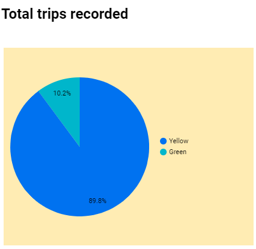
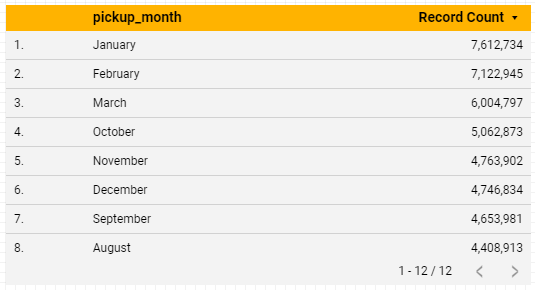

## Week 4 Homework - WIP
[Form](https://forms.gle/B5CXshja3MRbscVG8) 

We will use all the knowledge learned in this week. Please answer your questions via form above.  
* You can submit your homework multiple times. In this case, only the last submission will be used. 
**Deadline** for the homework is 21th Feb 2022 17:00 CET.


In this homework, we'll use the models developed during the week 4 videos and enhance the already presented dbt project using the already loaded Taxi data for fhv vehicles for year 2019 in our DWH.

We will use the data loaded for:
* Building a source table: stg_fhv_tripdata
* Building a fact table: fact_fhv_trips
* Create a dashboard 

If you don't have access to GCP, you can do this locally using the ingested data from your Postgres database
instead. If you have access to GCP, you don't need to do it for local Postgres -
only if you want to.

### DBT Project Repository for model build code 
https://github.com/anuwatavis/ny_taxi_zoomcamp


### Question 1: 
**What is the count of records in the model fact_trips after running all models with the test run variable disabled and filtering for 2019 and 2020 data only (pickup datetime)**  
You'll need to have completed the "Build the first dbt models" video and have been able to run the models via the CLI. 
You should find the views and models for querying in your DWH.

```
SELECT COUNT(1) FROM `anuwat-295814.dbt_awat.fact_trips` 
WHERE EXTRACT (YEAR FROM pickup_datetime) = 2019 
OR EXTRACT (YEAR FROM pickup_datetime) = 2020 ; 
```

### Question 2: 
**What is the distribution between service type filtering by years 2019 and 2020 data as done in the videos**

You will need to complete "Visualising the data" videos, either using data studio or metabase. 

 


```
# green services 
SELECT count(1) FROM `**********.dbt_awat.fact_trips` 
WHERE (EXTRACT(YEAR FROM pickup_datetime) = 2020 
OR EXTRACT(YEAR FROM pickup_datetime) = 2019) 
AND service_type = 'Green' ;
# yellow services 

SELECT count(1) FROM `**********.dbt_awat.fact_trips` 
WHERE (EXTRACT(YEAR FROM pickup_datetime) = 2020 
OR EXTRACT(YEAR FROM pickup_datetime) = 2019) 
AND service_type = 'Yellow' ;

# finally answers
yellow/green
89.9/10.1
```

### Question 3: 
**What is the count of records in the model stg_fhv_tripdata after running all models with the test run variable disabled (:false)**  

Create a staging model for the fhv data for 2019. Run it via the CLI without limits (is_test_run: false).
Filter records with pickup time in year 2019.

```
SELECT count(1) FROM `**********.production.stg_fhv_tripdata` WHERE (EXTRACT(YEAR FROM pickup_datetime) = 2020 OR EXTRACT(YEAR FROM pickup_datetime) = 2019);
```

### Question 4: 
**What is the count of records in the model fact_fhv_trips after running all dependencies with the test run variable disabled (:false)**  

Create a core model for the stg_fhv_tripdata joining with dim_zones.
Similar to what we've done in fact_trips, keep only records with known pickup and dropoff locations entries for pickup and dropoff locations. 
Run it via the CLI without limits (is_test_run: false) and filter records with pickup time in year 2019.

```
SELECT count(1) FROM `**********.production.=fact_fhv_trips` WHERE (EXTRACT(YEAR FROM pickup_datetime) = 2020 OR EXTRACT(YEAR FROM pickup_datetime) = 2019);
```

### Question 5: 
**What is the month with the biggest amount of rides after building a tile for the fact_fhv_trips table**
Create a dashboard with some tiles that you find interesting to explore the data. One tile should show the amount of trips per month, as done in the videos for fact_trips, based on the fact_fhv_trips table.



```
SELECT EXTRACT(MONTH FROM pickup_datetime), COUNT(1) as count  FROM `**********.product.fact_fhv_trips` GROUP BY EXTRACT (MONTH FROM pickup_datetime);
```


